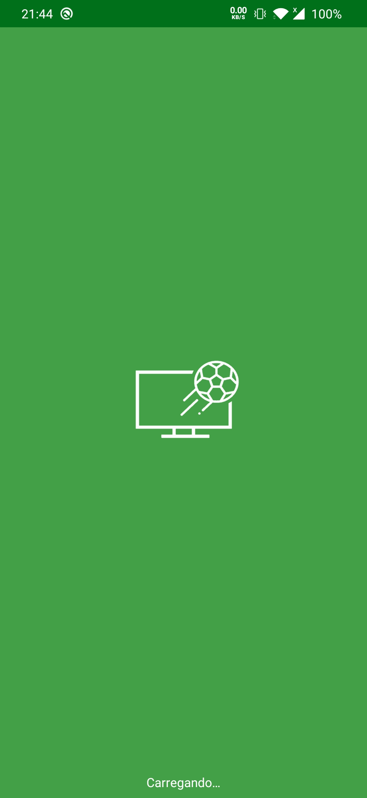
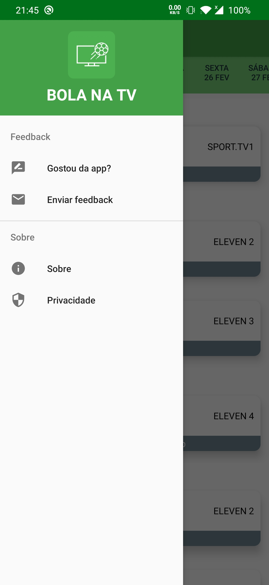
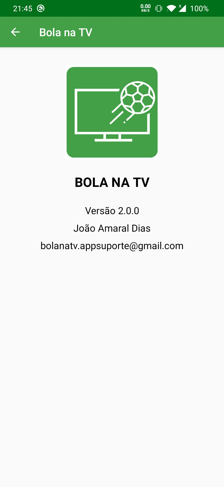

# BOLA NA TV
Android application that shows information about football match schedules on Portuguese television.

## Available on

## Main features
* List start dates of upcoming football matches for world football leagues;
* Consult the portuguese tv channel where each match will be broadcast;
* Set alarms for upcoming matches;

## Screenshots

